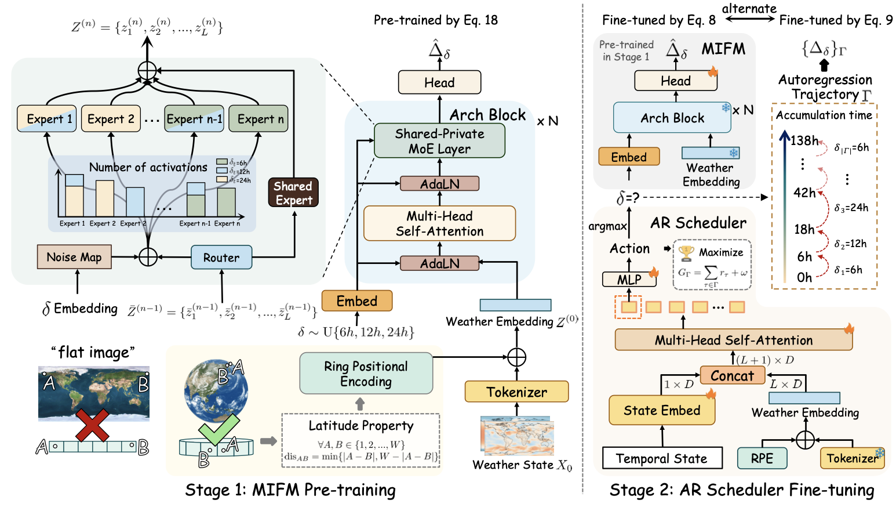

# ARROW: An Adaptive Rollout and Routing Method for Global Weather Forecasting

This repository contains the PyTorch implementation of ARROW, **“ARROW: An Adaptive Rollout and Routing Method for Global Weather Forecasting.”** In this work, we introduce **ARROW** for adaptively predicting global weather. Our model is composed of two stages: one-step pre-training for the **Multi-Interval Forecasting Model**, followed by multi-step fine-tuning for **Adaptive Rollout Scheduler**.



## Install

First, you should install the dependencies as listed in `env.yml` and activate the environment:

```bash
conda env create -f env.yml
conda activate Arrow
```

Then, you should install the GlobWeather package:

```bash
pip install -e .
```

## Usage

### Download and process data

**Raw Data Downloading**

We trained ARROW on ERA5 data (1.40625°) from WeatherBench 1. To download WB1 data, you can follow the [WB1](https://github.com/pangeo-data/WeatherBench) and refer to the Sec 4.1 in our paper. For example, you can downland the `u_component_of_wind` in this way:

```bash
wget -c "https://dataserv.ub.tum.de/s/m1524895/download?path=%2F1.40625deg%2Fu_component_of_wind&files=u_component_of_wind_1.40625deg.zip" -O u_component_of_wind_1.40625deg.zip
```
**Raw Data Directory**

After downloading the WB1 data, please organize the files as follows:

```
WB1_1p40625/
├── 2m_temperature/
│   ├── 2008.nc
│   ├── 2009.nc
│   ├── ...
│   └── 2018.nc
├── geopotential/
├── specific_humidity/
├── other variables...
```

**Time Downsampling**

Following existing work, the data frequency of the dataset is set to 6 hours (6h).

```shell
python GlobWeather/data_preprocessing/time_downsample.py \
    --root_dir ./WB1_1p40625 \
    --save_dir ./dataset/WB1_1p40625_6h \
    --start_year 2008 \
    --end_year 2018
```

**split train/val/test**

Next, we convert the NetCDF file to HDF5 format to facilitate more efficient data loading with PyTorch. To do this, run:

```shell
python GlobWeather/data_preprocessing/process_one_step_data.py \
    --root_dir [ROOT_DIR] \
    --save_dir [SAVE_DIR] \
    --start_year [START_YEAR] \
    --end_year [END_YEAR] \
    --split [SPLIT]
```

For example, the training set can be obtained as follows:

```shell
python GlobWeather/data_preprocessing/process_one_step_data.py \
    --root_dir ./dataset/WB1_1p40625_6h \
    --save_dir ./dataset/train \
    --start_year 2008 \
    --end_year 2016 \
    --split train
```

**normalization constants**

Considering ARROW is trained on the weather changes ($\Delta_{\delta} = X_{\delta} - X_0$), the normalization constants for a different time interval should be calculated as follows:

```shell
python GlobWeather/data_preprocessing/compute_normalization.py \
    --root_dir ./dataset/WB1_1p40625_6h \
    --save_dir ./dataset \
    --start_year 2008 \
    --end_year 2016 \
    --lead_time 6 \
    --data_frequency 6
```

The normalization constants are computed separately for different time intervals, such as 6h, 12h, and 24h.

**Congrats !** You complete all the preliminaries before training and inference. The dataset directory is as follows:

```
dataset/
├── train/
│   ├── 2008_0000.h5
│   ├── ...
│   └── 2016_1458.h5
├── val/
│   └── validation files...
├── test/
│   └── test files...
├── lat.npy
├── lon.npy
├── normalize_diff_mean_6.npy
├── normalize_diff_mean_12.npy
├── ...
├── normalize_diff_std_24.npy
├── normalize_mean.npy
└── normalize_std.npy
```

### Training

**Stage 1: one-step pre-training**

```shell
python ./Run/pre_train.py \
    --config configs/ARROW/pretrain_one_step.yaml \
    --data.root_dir ./dataset \
    --trainer.logger.init_args.mode disabled
```

**Stage 2: multi-step fine-tuning**

```shell
python ./Run/fine_tune_RL.py\
    --config configs/ARROW/finetune_RL.yaml \
    --model.root_dir ./dataset \
    --model.weather_path [PRETRAINING CHECKPOINT]
```

### Inference

We provide two inference ways:

* fixed strategy

  ```shell
  python Run/inference_PL.py \
      --config configs/ARROW/inference.yaml \
      --data.root_dir ./dataset \
      --data.val_batch_size 4 \
      --model.pretrained_path [CHECKPOINT]
  ```

* adaptive strategy

  ```shell
  python ./Run/inference_RL.py\
      --config configs/ARROW/inference_RL.yaml \
      --model.root_dir ./dataset \
      --model.weather_path [CHECKPOINT]
  ```

### Note

The `./configs/ARROW` directory contains all training and inference settings. Please feel free to modify them according to your needs.
